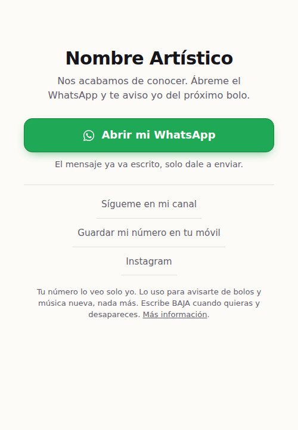
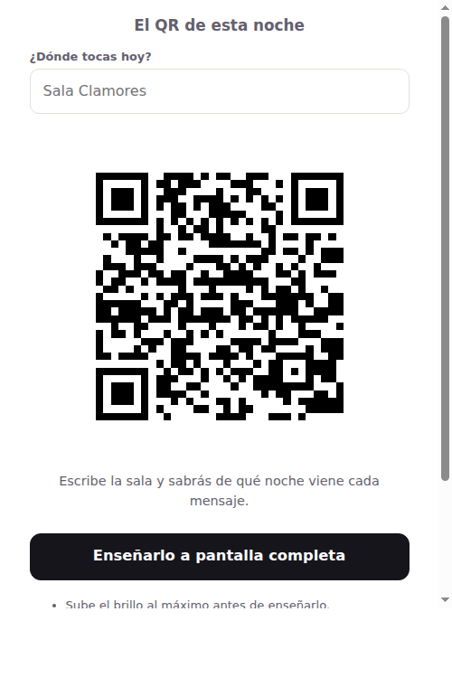

# Contacto de la artista — QR y NFC a WhatsApp

Sistema para que, después de un bolo, quien se acerque a hablar con ella acabe
en su WhatsApp de dos toques, y para que ese contacto no se pierda.

**Empieza por [`docs/00-resumen.md`](docs/00-resumen.md).**

<p align="center">
  
  
</p>

## Cómo se usa

```bash
# 1. Rellenar config.js (es el único fichero que se toca)
# 2. Generar la web, la tarjeta de contacto, los QR y la tarjeta de visita
node herramientas/construir.js

# 3. Comprobar que todo sigue bien
node herramientas/probar-qr.js      # el generador de QR
node herramientas/probar-web.js     # la página, en un Chromium de verdad
```

Después se sube el contenido de `web/` a una carpeta del subdominio. Los detalles,
en [`docs/03-montaje-web.md`](docs/03-montaje-web.md).

## Qué hay aquí

```
config.js            Lo único que se toca: número, textos, enlaces, soportes
web/                 Lo que se sube al subdominio
  index.html           La página puente: un botón grande a WhatsApp
  qr.html              El QR que ella enseña en el móvil, distinto en cada bolo
  privacidad.html      Aviso de privacidad
herramientas/
  qr.js                Generador de códigos QR, sin dependencias
  leer-qr.js           Decodificador, escrito aparte para comprobar el anterior
  urls.js              Qué dirección lleva dentro cada soporte
  construir.js         Genera todo a partir de config.js
  hacer-tarjeta.js     La tarjeta de visita lista para imprenta
  hacer-vcf.js         La ficha de contacto que se descarga el fan
  generador.html       Para regenerar cualquier QR sin tocar código
  probar-qr.js         180 comprobaciones del generador
  probar-web.js        54 comprobaciones de la página y el contador
servidor/
  contar.php           Contador de escaneos para cPanel, sin cookies
imprenta/              Generado: los SVG que van a la imprenta
docs/                  Por qué está hecho así, y cómo se usa en el bolo
```

## Decisiones que conviene no re-litigar

- **El QR nunca apunta a `wa.me` directamente.** Apunta a una página suya. Así se
  puede cambiar el mensaje, el destino y hasta el número sin reimprimir nada, se
  sabe qué soporte funciona, y su teléfono no queda impreso para siempre en 500
  tarjetas.
- **La página no salta sola a WhatsApp.** Dentro de Instagram o TikTok eso deja a
  la persona tirada en una pantalla de inicio de sesión, y además se pierde la
  frase que hace que el sistema funcione: *el mensaje ya va escrito, solo dale a
  enviar*.
- **«Guárdame en contactos» no es el botón principal.** En iPhone el archivo se
  descarga antes de poder añadirse y el camino se bifurca: quien se pierde se
  queda creyendo que ya está.
- **Sin dependencias y sin servicios de terceros.** Ni `npm install`, ni CDN, ni
  generador de QR de pago. Cuando Google apagó su acortador `goo.gl`, el alcance
  final del apagado se fue redefiniendo sobre la marcha — y ese es exactamente el
  problema: la decisión no era suya. Un redirector ajeno puede cerrar, cambiar de
  plan o empezar a cobrar, y se lleva por delante todo el material ya impreso.

El razonamiento largo está en [`docs/01-analisis-metodos.md`](docs/01-analisis-metodos.md).
