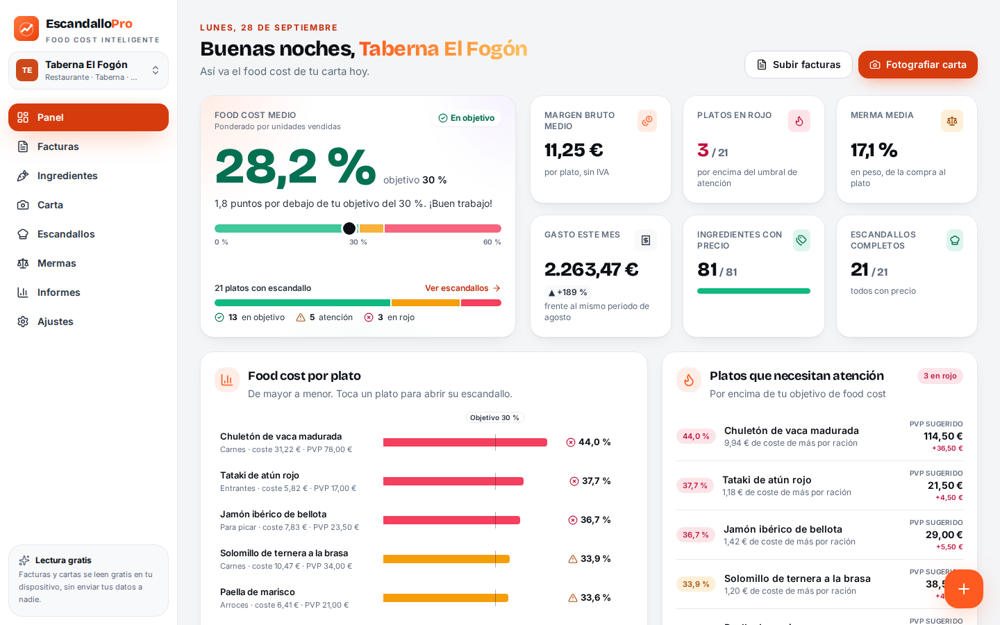
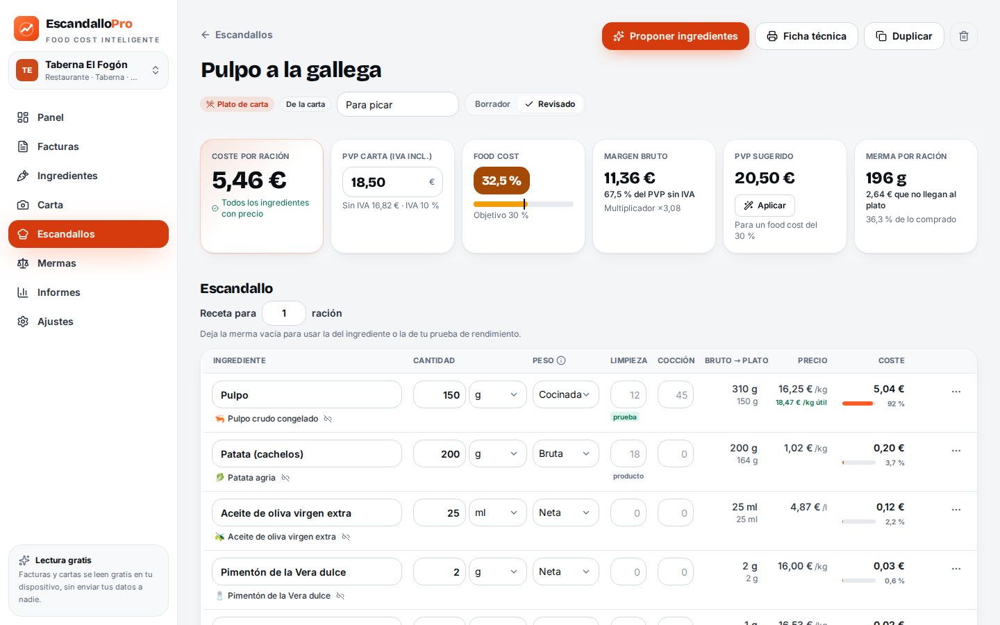
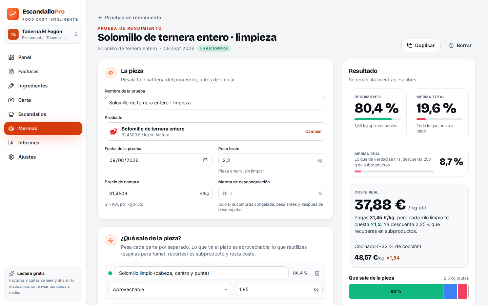
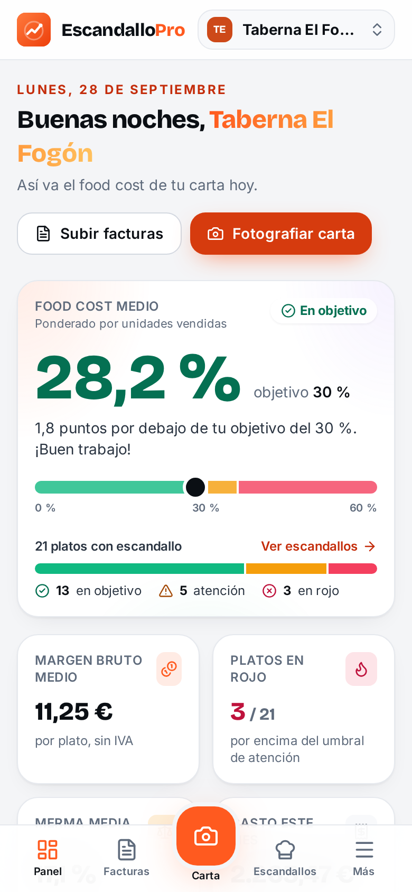

# Escandallo Pro · Food cost inteligente para hostelería

**Sube tus facturas, haz una foto a la carta y obtén el escandallo, el food cost y la merma de cada plato en minutos. Gratis, en tu dispositivo, sin enviar tus datos a nadie.**



Escandallo Pro es una aplicación web progresiva (PWA) para restaurantes, bares, grupos de restauración y
agencias/consultoras de hostelería. Funciona en el móvil, la tablet y el ordenador, se instala como una app y trabaja
**sin conexión**: todos los datos se guardan en el propio dispositivo.

## Qué hace

| Paso | Qué ocurre |
| --- | --- |
| **1. Facturas** | Arrastra facturas en PDF, fotos del móvil (también una factura larga en varias fotos), PDF escaneados o un Excel/CSV con tu listado de compras. Entiende también las facturas de mayoristas y cash & carry (artículos en dos filas con código de unidad, pesos, trazabilidad y total por página). Se leen proveedor, CIF, número, fecha, líneas, cantidades, formatos («caja 6×1 l», «saco 25 kg»), descuentos, IVA y totales; cada línea se valida (cantidad × precio × (1 − dto) = importe; suma de líneas = base imponible) y se calcula el **precio real por kg, litro o unidad**. Avisa de facturas repetidas y de líneas dudosas. |
| **2. Base de ingredientes** | Cada línea se coteja con tus ingredientes (tolerante a abreviaturas de proveedor, plurales, marcas y calibres) y aprende tus nombres. Histórico de precios, **alertas de subida**, fusión de duplicados e importación de tarifas. |
| **3. Foto de la carta** | Fotografía la carta (una o varias páginas, también pizarras) o sube el PDF: secciones, platos, descripciones y PVP, listos para revisar. |
| **4. Propuesta de escandallo** | Para cada plato se proponen ingredientes con gramajes profesionales por ración (recetario local con 620 ingredientes y 300+ recetas tipo, o IA opcional) y se **cotejan con los productos de tus facturas**; lo que falte se crea con un precio estimado que se corrige solo al subir la factura. |
| **5. Escandallo y food cost** | Coste por ración, food cost %, margen, multiplicador, **PVP sugerido** para tu objetivo, precio máximo de compra por ingrediente, elaboraciones anidadas (salsas, fondos, masas), alérgenos automáticos (14 del Reglamento UE 1169/2011) y ficha técnica imprimible. |
| **6. Mermas** | Merma de limpieza y de cocción por ingrediente con peso bruto/neto/servido, **merma total y merma por plato** en gramos y en euros (incluida la de sus elaboraciones) y **pruebas de rendimiento por pieza**: rendimiento real, coste €/kg aprovechable descontando subproductos, raciones por pieza y merma por ración. 24 plantillas de despiece. |
| **7. Informes** | Panel con KPIs y semáforo, ingeniería de menú (estrellas, caballos de batalla, enigmas y perros), evolución de precios, compras, mermas, simulador «¿y si sube el precio?» y exportación a Excel. |

Además: **multi-restaurante** (cada cliente con sus datos separados, ideal para agencias), copias de seguridad,
tema claro/oscuro, accesibilidad AA y un restaurante de ejemplo para probarla en un clic.

| Escandallo | Prueba de rendimiento | Móvil |
| --- | --- | --- |
|  |  |  |

## Lectura de documentos gratuita y local

La lectura de facturas y cartas es **gratis y funciona entera en el dispositivo**: capa de texto de los PDF con
reconstrucción de columnas, OCR con **PaddleOCR (PP-OCRv5, reconocedor latino)** en WebAssembly y **Tesseract** de
respaldo, preprocesado de imagen (papel y perspectiva, iluminación, enderezado, bandas oscuras, rayas de tabla) y
validación aritmética que elige entre lecturas y corrige errores del OCR solo cuando las cuentas lo demuestran.
Todos los motores y modelos se sirven desde la propia app (sin CDN) y quedan en caché para usarse sin conexión.

Precisión medida con documentos **que el sistema no vio al ajustarse** (semillas reservadas de un generador procedural
de facturas y cartas, con variantes degradadas: foto girada, perspectiva, sombra, baja resolución, escaneo):

| Documento | Líneas / platos exactos |
| --- | --- |
| Facturas en PDF con texto | **97,4 %** (cabeceras 99,9 %) |
| Facturas en foto o escaneadas | **~90 %** (cabeceras ~94 %) |
| Cartas en foto limpia / degradada | **~80 % / ~79 %** |
| Facturas de mayorista (cash & carry) en PDF con texto | **100 %** (cabeceras 100 %) |
| Facturas de mayorista en foto / escaneadas | **~97 % / ~82 %** (cabeceras ~98 % / ~94 %) |
| Documentos de ejemplo (`public/samples`) | **100 %** |

Siempre se muestra una pantalla de revisión antes de guardar nada, con las líneas dudosas marcadas.

**Consejo para las fotos:** hazlas desde la app («Hacer foto») o, si llegan por WhatsApp, que te las envíen como
*documento*: como foto, WhatsApp las reduce a 1600 px y la letra pequeña de una factura entera se pierde (la app lo avisa).

## IA opcional (Claude)

La IA está **desactivada por defecto** y no hace falta para nada. Si quieres una segunda opinión en documentos muy
difíciles, puedes activarla en **Ajustes → Inteligencia artificial** con tu propia clave de Anthropic (Claude Opus 5
por defecto; también Sonnet 5 y Haiku 4.5). La clave se guarda solo en tu dispositivo y, si la IA falla, la app vuelve
sola a la lectura local.

## Desarrollo

```bash
cd escandallo-pro
npm install
npm run dev          # servidor de desarrollo
npm test             # 1.600+ tests unitarios (vitest)
npm run build        # build de producción (dist/)
npm run test:e2e     # build + E2E con Playwright: humo, sin conexión, compras, carta, lector OCR, rendimiento
npm run bench        # precisión de lectura sobre public/samples
npm run bench:random # precisión en facturas y cartas generadas (semillas de ajuste y reservadas)
```

En la app, las pantallas de **Facturas** y **Carta** tienen un botón para probar con documentos de ejemplo
(`public/samples/`).

## Despliegue

Es una app estática: basta con servir `dist/` en cualquier hosting (GitHub Pages, Netlify, Vercel, Nginx…). Usa rutas
relativas y `HashRouter`, así que funciona en cualquier subruta.

El repositorio incluye `.github/workflows/deploy-escandallo-pro.yml`, que ejecuta los tests, construye la app y la
publica en GitHub Pages al hacer push a `main` (activa **Settings → Pages → Source: GitHub Actions**).

## Arquitectura

Consulta [ARCHITECTURE.md](./ARCHITECTURE.md): stack, mapa de módulos, convenciones y fórmulas de cálculo.
